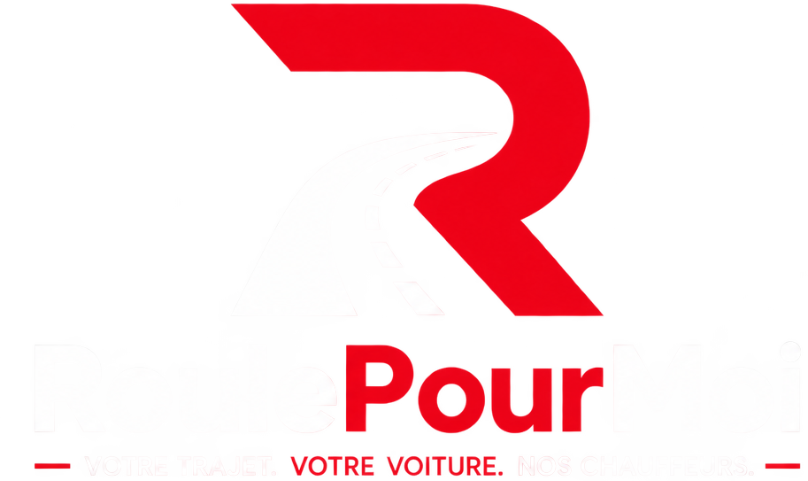

<div align="center">
  

  <p><strong>Votre trajet. Votre voiture. Nos chauffeurs.</strong></p>

  <p>
    
    
    
    
  </p>
</div>

---

## À propos

Chaque année en France, la conduite sous l'emprise de l'alcool ou de stupéfiants reste la première cause de mortalité sur la route : **29 % des accidents mortels**, plus de 1 000 vies perdues, 3,9 milliards d'euros de coût social par an. Les solutions existantes (taxi, VTC, transports en commun) savent ramener une personne chez elle — aucune ne sait ramener **la personne et son véhicule** en même temps. Résultat : de nombreux conducteurs reprennent le volant simplement pour récupérer leur voiture.

**RoulePourMoi** comble ce manque. C'est une plateforme de mise en relation avec un réseau de chauffeurs professionnels : le chauffeur rejoint le client avec un moyen de transport léger et pliable (vélo, trottinette...), le range dans le coffre, puis conduit le client **jusqu'à chez lui avec sa propre voiture**. Le client retrouve son véhicule à sa porte, en toute sécurité — le chauffeur repart ensuite avec son moyen de transport pour une nouvelle mission.

> Le concept a déjà fait ses preuves à grande échelle en Chine avec eDaijia (200M+ utilisateurs, 1M+ chauffeurs partenaires). RoulePourMoi l'adapte au marché français : particuliers, entreprises, bars et restaurants, organisateurs d'événements, assureurs et collectivités.

Projet porté par **Alexandre Pomares**, ancien gendarme (~15 ans d'expérience en sécurité routière), fondateur de RoulePourMoi.

## Fonctionnalités de l'app

Le parcours actuellement implémenté dans cette app React Native :

**Côté client**
- Écran d'accueil (choix client / chauffeur, connexion)
- Connexion et inscription client

**Côté chauffeur**
- Connexion et inscription chauffeur
- Onboarding chauffeur en 4 étapes, avec suivi de progression :
  1. **Documents** — envoi du permis, de l'attestation d'assurance, de la pièce d'identité et d'une photo de profil
  2. **Formation** — carrousel pédagogique basé sur le support de formation officiel (rôle du chauffeur, sécurité routière, relation client, situations sensibles, premiers secours, procédures, valeurs de l'entreprise)
  3. **Questionnaire** — quiz de validation des acquis, à choix multiples, avec score final
  4. **Validation** — récapitulatif (score, statut formation/questionnaire) puis écran d'attente d'activation du compte

L'ensemble de l'interface (couleurs, typographie, espacements, composants) suit un système de design partagé (`src/styles`) construit au fil du développement de l'app, pour rester cohérent et facile à étendre sur les prochains écrans.

## Stack technique

| | |
|---|---|
| Framework | [Expo](https://docs.expo.dev/versions/v57.0.0/) SDK 57 · React Native 0.86 · React 19 |
| Navigation | [expo-router](https://docs.expo.dev/router/introduction/) (routing par fichiers) |
| Langage | TypeScript (mode strict) |
| Police | Raleway (via `expo-font`) |
| Icônes | SVG inline (`react-native-svg`), issues de Bootstrap Icons ou dessinées sur mesure |
| Style | `StyleSheet` React Native + design tokens maison (`src/styles`) |

## Structure du projet

```
src/
├── app/            # Écrans (routing par fichiers, expo-router)
├── components/      # Composants UI réutilisables
├── data/            # Contenus (slides formation, questions du quiz)
└── styles/           # Design system : couleurs, typographie, espacements, styles partagés
assets/
├── fonts/            # Raleway
├── icons/            # Icônes sources (SVG)
└── images/           # Logo, visuels, illustrations
```

## Démarrage

```bash
npm install
npx expo start
```

Depuis la sortie de la commande, ouvrez le projet dans un [build de développement](https://docs.expo.dev/develop/development-builds/introduction/), un émulateur Android, un simulateur iOS, ou [Expo Go](https://expo.dev/go).

```bash
npx expo start --android   # Android
npx expo start --ios       # iOS
npx expo start --web       # Web
```

---

<div align="center">
  <sub>Sécurité · Innovation · Mobilité · Responsabilité</sub>
</div>
